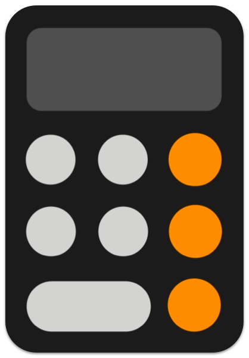
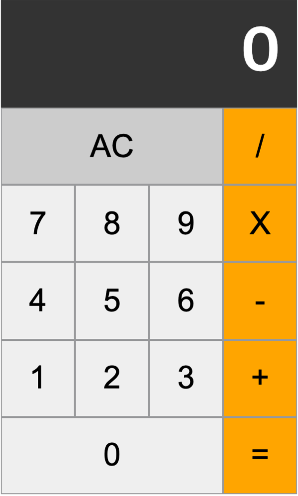

 
 

  

<h2 align="middle">자바스크립트 계산기</h2>

자바스크립트 계산기로 익혀보는 테스트 코드

  
  
  
  
  

## 🔥 Projects!

  

  <a href="https://blackcoffee-study.github.io/js-calculator-test/">🖥️ 데모 링크</a>

## 🎯 기능 요구사항

- [x] 2개의 숫자에 대해 덧셈이 가능하다.
- [x] 2개의 숫자에 대해 뺄셈이 가능하다.
- [x] 2개의 숫자에 대해 곱셈이 가능하다.
- [x] 2개의 숫자에 대해 나눗셈이 가능하다.
- [x] AC(All Clear)버튼을 누르면 0으로 초기화 한다.
- [x] 숫자는 한번에 최대 3자리 수까지 입력 가능하다.
- [x] 계산 결과를 표현할 때 소수점 이하는 버림한다.

 

## 📊 테스트 요구사항

**기능 요구사항에 제시된 7개의 항목에 대해 테스트 케이스를 만든다.**

 

## 📄 참고 사항

- 숫자 입력은 **클릭**으로만 가능하다.

 

## 👏🏼 Contributing

만약 미션 수행 중에 개선사항이 보인다면, 언제든 자유롭게 PR을 보내주세요.

 

## 🐞 Bug Report

버그를 발견한다면, [Issues](https://github.com/blackcoffee-study/js-calculator/issues)에 등록해주요.

 

## 📝 License

This project is [MIT](https://github.com/blackcoffee-study/js-calculator/blob/master/LICENSE) licensed.

## 정리

### 테스트를 작성(해야)하는 이유

- '두려움' => '자신감'

 

### 테스트란?

- 애플리케이션이 요구 사항에 맞게 동작하는지를 검증하는 행위

 

### 테스트의 예

- DB에 데이터를 입력하는 API를 개발 -> API를 호출 -> DB값 검증
- 디자인 시안에 맞게 HTML/CSS를 작성 -> 브라우저에서 실제 렌더링된 결과를 확인
- 새로운 기능을 추가하기 위해 기존 모듈을 리팩톨이 -< 영향을 받는 다른 모듈의 실행 결과를 확인
- 버그를 수정하기 위해 기존 함수를 수정 -> 버그가 수정 확인 & 영향을 받는 다른 모듈의 실행 결과를 확인
- 개발 환경에서 테스트된 어플리케이션을 리얼 환경에 배포 -> 배포 과정에서 발생한 문제가 없는지 확인

 

### 개발과 테스트

- 개발자는 사실상 코드를 작성하는 것보다 더 많은 시간을 테스트에 사용

 

## 왜 테스트를 작성하는가?

### >> 테스트 자동화

#### 장점

- 사람이 수행해야 하는 반복된 테스트를 자동화할 수 있음 (비용 감소)

* 사람이 수행하는 것보다 훨씬 빠르게 테스트할 수 있음

- 사람이 수행하는 것보다 더 신뢰할 수 있음

#### 단점

- 감각적인 요소(시각, 청각) 등 사용자 경험과 관련된 문제를 찾아낼 수 없음

* 실제 환경에서 벌어지는 다양한 상황을 자동화하기 어려움 (네트워크, 디바이스 관련 등)

#### 테스트 자동화는 누가 하는가?

- 개발자 & QA (둘 다)

### 개발자가 테스트를 작성해야 하는 이유

#### 제품 풀질

- 개발자는 작성한 프로그램의 퀄리티에 대한 책임이 있음
- QA에 넘기기 전에 기본 요구사항을 모두 만족하는지에 대한 검증은 개발자가 해야 함
- 자동화된 테스트를 작성해 두지 않으면, 어플리케이션이 복잡해질 수록 테스트 비용이 증가함
- 이 경우 개발 기간이나 인력 등은 한정되어 있기 때문에, 테스트를 소홀히 하게 되는 경우가 많음
- 그렇지 않은 경우 **QA 와의 커뮤니에케이션 비용이 늘어나**, 업무 효율이 떨어지게 됨

#### 코드 품질

- 코드 품질을 위해서는 계속해서 리팩토링 동의 개선 작업이 필요
- 이 과정에서 기존에 잘 동작하던 프로그램을 망칠 수 있기 때문에 적극적으로 코드를 개선하지 않게 됨
- 신뢰할 수 있는 자동화된 테스트가 있으면 적극적으로 코드를 개선할 수 있음
